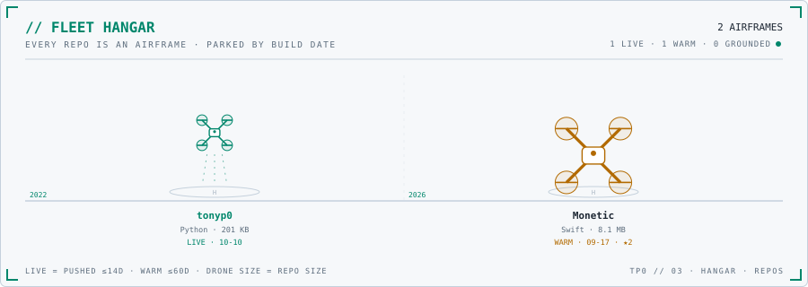
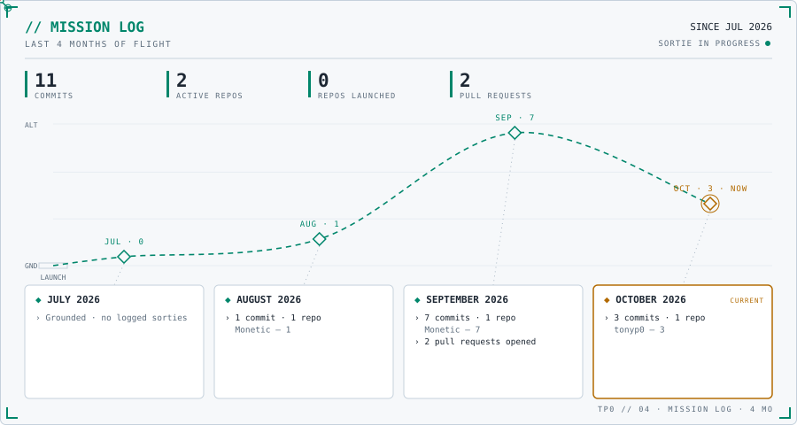

<!-- ══════════════════════════════════════════════════════════════════
     tonyp0 · FLIGHT OPS
       01 PILOT ID      who's flying
       02 TERRAIN       the last year of commits, surveyed from above
       03 HANGAR        every repo as an airframe
       04 MISSION LOG   the last four months, flown
     Every card is a generated SVG (scripts/), re-rendered hourly from
     live GitHub data by .github/workflows/profile-cards.yml.
     Edit profile.toml to change the ID card text.
     ══════════════════════════════════════════════════════════════════ -->

<picture>
  <source media="(prefers-color-scheme: dark)" srcset="pilot_id_dark.svg">
  
</picture>

<picture>
  <source media="(prefers-color-scheme: dark)" srcset="terrain_dark.svg">
  
</picture>

<picture>
  <source media="(prefers-color-scheme: dark)" srcset="hangar_dark.svg">
  
</picture>

<!-- manifest:start -->

<b>OPEN THE HANGAR MANIFEST</b>: every airframe above, with links

| AIRFRAME | LANG | STATUS | LAST PUSH | NOTE |
|---|---|---|---|---|
| [tonyp0](https://github.com/tonyp0/tonyp0) | Python | LIVE | 2026-10-09 | Config files for my GitHub profile. |
| [Monetic](https://github.com/tonyp0/Monetic) | Swift | WARM | 2026-09-17 | Simple monthly budgeting app to support healthy finances and track your spending. |

<!-- manifest:end -->

<picture>
  <source media="(prefers-color-scheme: dark)" srcset="mission_log_dark.svg">
  
</picture>

  
<strong>AI / ML · iOS · DRONE SOFTWARE</strong>

  

    <a href="https://www.linkedin.com/in/YOUR-LINKEDIN/">LinkedIn</a> ·
    <a href="mailto:YOUR-EMAIL">Email</a> ·
    <a href="https://github.com/tonyp0/Monetic">Monetic</a>
  

